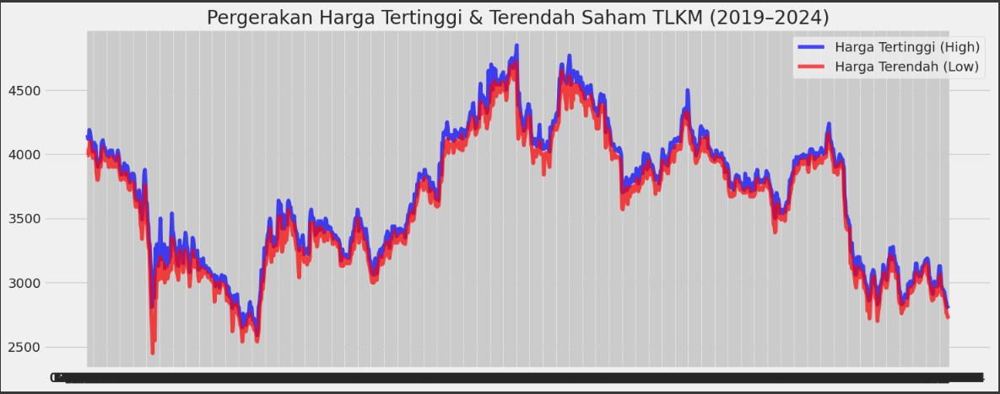
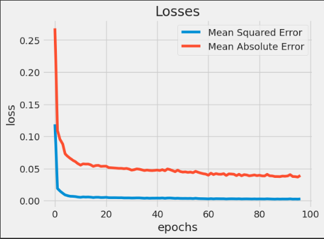
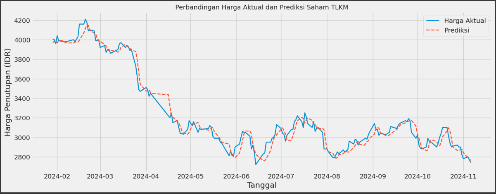

Berikut adalah perbaikan laporan proyek sesuai dengan template dan catatan dari Reviewer:

---

# Laporan Proyek Machine Learning - Prediksi Harga Saham TLKM Menggunakan LSTM

## Domain Proyek

**Latar Belakang**:  
PT Telekomunikasi Indonesia Tbk (TLKM) adalah salah satu perusahaan BUMN terbesar di Indonesia di sektor telekomunikasi. Harga saham TLKM menjadi indikator penting bagi investor karena mencerminkan stabilitas dan prospek bisnis sektor telekomunikasi nasional. Namun, harga saham TLKM sangat fluktuatif dan dipengaruhi oleh berbagai faktor seperti kondisi pasar, kebijakan pemerintah, dan sentimen investor.  

Dengan kemajuan *Machine Learning (ML)*, analisis data historis dapat digunakan untuk memprediksi harga saham. Metode LSTM (Long Short-Term Memory) sangat efektif untuk prediksi data time series karena mampu menangkap pola jangka panjang dan kompleks dalam data historis. Prediksi ini dapat membantu investor dalam pengambilan keputusan.  

**Penelitian Terkait**:  
Windha Mega Pradnya Dhuhita (2023) dalam penelitiannya menyatakan bahwa LSTM, terutama dengan optimasi hiperparameter, mampu memprediksi harga aset seperti saham dan emas secara akurat menggunakan data historis. Referensi: [IEEE](https://doi.org/10.1109/ICIMCIS60089.2023.10349035).  

---

## Business Understanding

### Problem Statements  
1. Harga saham TLKM sangat fluktuatif dan sulit diprediksi secara manual karena dipengaruhi banyak faktor.  
2. Diperlukan model prediksi berbasis ML yang akurat untuk membantu investor memproyeksikan harga saham TLKM di masa depan.  

### Goals  
1. Mengembangkan model prediksi harga saham TLKM yang akurat menggunakan data historis.  
2. Membantu investor memahami tren harga saham TLKM melalui prediksi berbasis LSTM.  

### Solution Statements  
- Menggunakan arsitektur LSTM dengan optimasi hyperparameter untuk menangkap pola data time series.  
- Memanfaatkan data historis 5 tahun (2019-2024) untuk pelatihan dan validasi model.  
- Evaluasi model menggunakan metrik MAE (Mean Absolute Error) dan MSE (Mean Squared Error) untuk mengukur akurasi prediksi.  

---

## Data Understanding

**Sumber Dataset**: [Yahoo Finance - TLKM.JK](https://finance.yahoo.com/quote/TLKM.JK)  

### Variabel-variabel pada Dataset:  
| Kolom      | Tipe Data | Deskripsi                     |  
|------------|-----------|-------------------------------|  
| Date       | datetime  | Tanggal pencatatan harga saham |  
| Open       | float64   | Harga pembukaan saham          |  
| High       | float64   | Harga tertinggi harian         |  
| Low        | float64   | Harga terendah harian          |  
| Close      | float64   | Harga penutupan saham          |  
| Adj Close  | float64   | Harga penutupan disesuaikan    |  
| Volume     | float64   | Volume perdagangan saham       |  

**Statistik Deskriptif**:  
- Jumlah data: **1212 observasi** (07/11/2019 - 22/10/2024).  
- Tidak ada missing values atau data null.  

**Korelasi Antar Variabel**:  
- Korelasi sangat kuat (>0.99) antar variabel harga (Open, High, Low, Close, Adj Close).  
- Korelasi rendah antara Volume dan variabel harga (~0.1).  

**Visualisasi Data**:  
  
*Grafik menunjukkan tren harga saham TLKM dari 2019 hingga 2024.*  

---

## Data Preparation

1. **Pemilihan Kolom**: Kolom `Close` dipilih sebagai target prediksi.  
2. **Normalisasi Data**: Menggunakan `MinMaxScaler` untuk menskalakan data ke rentang [0, 1].  
3. **Pembagian Data**:  
   - Data latih: 80% (969 observasi).  
   - Data uji: 20% (243 observasi).  
4. **Windowing**: Membuat input LSTM dengan window 60 langkah waktu sebelumnya untuk memprediksi 1 langkah ke depan.  
5. **Reshape Data**: Data diubah ke format 3 dimensi (samples, timesteps, features) untuk kompatibilitas LSTM.  

---

## Modeling

### Arsitektur Model LSTM  
Model terdiri dari:  
1. **LSTM Layer Pertama**: 64 unit dengan `return_sequences=True` untuk mempertahankan urutan waktu.  
2. **Dropout Layer**: Rate 0.2 untuk mengurangi overfitting.  
3. **LSTM Layer Kedua**: 64 unit dengan `return_sequences=False`.  
4. **Dense Layers**: 32 dan 16 unit dengan aktivasi ReLU untuk ekstraksi fitur.  
5. **Output Layer**: 1 unit untuk prediksi harga.  

**Parameter Pelatihan**:  
- Optimizer: Adam.  
- Loss function: MSE.  
- Metrics: MAE.  
- Epochs: 100 dengan EarlyStopping.  

**Hasil Pelatihan**:  
  
*Grafik menunjukkan penurunan loss (MSE dan MAE) selama pelatihan.*  

---

## Evaluation

### Metrik Evaluasi  
| Metric         | Nilai       |  
|----------------|-------------|  
| Test Loss (MSE)| 0.000883    |  
| Test MAE       | 0.0224      |  
| MAE Aktual     | 49.53 IDR   |  
| Error Relatif  | 1.42%       |  

**Visualisasi Prediksi**:  
  
*Grafik menunjukkan prediksi harga saham (merah) vs. harga aktual (biru).*  

### Analisis Terkait Business Understanding  
1. **Problem Statement 1**: Model berhasil memprediksi fluktuasi harga dengan MAE 1.42%, menjawab kebutuhan prediksi yang akurat.  
2. **Problem Statement 2**: LSTM efektif menangkap pola historis, memberikan proyeksi harga yang berguna bagi investor.  
3. **Solution Statements**:  
   - Arsitektur LSTM + optimasi hyperparameter terbukti efektif (MAE rendah).  
   - Data 5 tahun cukup untuk pelatihan model yang stabil.  

### Rekomendasi  
1. Tambahkan fitur fundamental (e.g., P/E ratio) dan teknikal (e.g., RSI).  
2. Eksperimen dengan arsitektur LSTM lebih dalam atau hybrid model.  

---

**Referensi**:  
1. Dataset: [Yahoo Finance - TLKM.JK](https://finance.yahoo.com/quote/TLKM.JK).  
2. Windha Mega Pradnya Dhuhita et al. (2023). *Gold Price Prediction Using LSTM*. IEEE.  

--- 