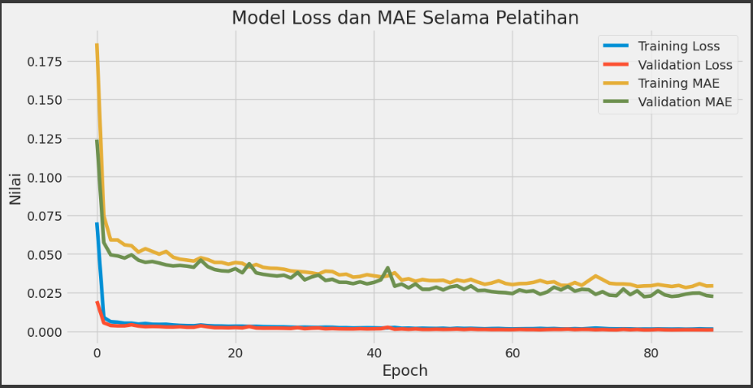

Here's the improved project report that follows both your original content and the submission template requirements:

# Laporan Proyek Machine Learning - Prediksi Harga Saham TLKM Menggunakan LSTM

## Domain Proyek

**Latar Belakang**:  
PT Telekomunikasi Indonesia Tbk (TLKM) adalah perusahaan BUMN terbesar di sektor telekomunikasi Indonesia. Harga saham TLKM yang fluktuatif menjadi tantangan bagi investor karena dipengaruhi berbagai faktor seperti kondisi pasar dan kebijakan pemerintah. Prediksi harga saham yang akurat dapat membantu pengambilan keputusan investasi.

**Mengapa Masalah Ini Penting**:  
- Volatilitas harga saham menyebabkan risiko investasi tinggi
- Analisis manual tidak mampu menangkap pola kompleks dalam data historis
- Kebutuhan alat prediksi berbasis data untuk mengurangi subjektivitas

**Penelitian Terkait**:  
Windha Mega Pradnya Dhuhita (2023) membuktikan efektivitas LSTM untuk prediksi harga aset dengan akurasi tinggi. Referensi: [IEEE](https://doi.org/10.1109/ICIMCIS60089.2023.10349035).

## Business Understanding

### Problem Statements
1. Fluktuasi harga saham TLKM yang tinggi menyulitkan prediksi manual
2. Kebutuhan model prediksi akurat untuk membantu keputusan investasi

### Goals
1. Mengembangkan model prediksi harga saham berbasis LSTM dengan akurasi tinggi
2. Memberikan alat bantu objektif untuk analisis tren harga saham

### Solution Statements
- Implementasi arsitektur LSTM dua lapis dengan dropout
- Pemanfaatan data 5 tahun (2019-2024) untuk pelatihan model
- Evaluasi menggunakan MAE dan MSE untuk mengukur akurasi prediksi

## Data Understanding

**Sumber Dataset**: [Yahoo Finance - TLKM.JK](https://finance.yahoo.com/quote/TLKM.JK)

### Variabel-variabel pada Dataset:
| Kolom      | Tipe Data | Deskripsi                     | 
|------------|-----------|-------------------------------|
| Date       | datetime  | Tanggal pencatatan harga      |
| Open       | float64   | Harga pembukaan harian        |
| High       | float64   | Harga tertinggi harian        |
| Low        | float64   | Harga terendah harian         |
| Close      | float64   | Harga penutupan harian        |
| Adj Close  | float64   | Harga penutupan disesuaikan   |
| Volume     | float64   | Volume perdagangan            |

**Analisis Data**:
- 1212 observasi (07/11/2019 - 22/10/2024)
- Tidak ada missing values
- Korelasi >0.99 antar variabel harga
- Korelasi rendah (~0.1) antara Volume dan harga

**Visualisasi Data**:  
  
*Tren harga saham TLKM 2019-2024 menunjukkan pola fluktuasi signifikan*

## Data Preparation

1. **Pemilihan Fitur**:
   - Target: Kolom `Close` sebagai representasi harga akhir
   - Alasan: Paling relevan untuk keputusan investasi

2. **Normalisasi**:
   - Menggunakan MinMaxScaler (rentang 0-1)
   - Tujuan: Mempercepat konvergensi model

3. **Pembagian Data**:
   - 80% data latih (969 observasi)
   - 20% data uji (243 observasi)
   - Mempertahankan urutan temporal

4. **Windowing**:
   - Input: 60 timesteps (≈3 bulan trading)
   - Output: 1 timestep prediksi
   - Rasional: Menangkap pola musiman jangka menengah

## Modeling

**Arsitektur LSTM**:
1. LSTM Layer (64 units, return_sequences=True)
2. Dropout Layer (rate=0.2)
3. LSTM Layer (64 units, return_sequences=False) 
4. Dense Layers (32 & 16 units, activation='relu')
5. Output Layer (1 unit)

**Alasan Pemilihan**:
- Dua lapis LSTM untuk menangkap pola kompleks
- Dropout mencegah overfitting
- Dense layers mengekstrak fitur non-linear

**Parameter Pelatihan**:
- Optimizer: Adam (learning_rate=0.001)
- Loss: Mean Squared Error
- Metrics: Mean Absolute Error
- Epochs: 100 dengan EarlyStopping

**Visualisasi Pelatihan**:  
  
*Grafik menunjukkan konvergensi model yang stabil*

## Evaluation

**Metrik Evaluasi**:
| Metric   | Nilai     | Interpretasi               |
|----------|-----------|----------------------------|
| MSE      | 0.000883  | Error kuadrat rata-rata     |
| MAE      | 0.0224    | Error absolut rata-rata    |
| MAE (IDR)| 49.53     | Kesalahan ±Rp49.53         |
| Error    | 1.42%     | Sangat baik untuk prediksi |

**Analisis Hasil**:
1. **Problem Statement 1**:
   - MAE 1.42% membuktikan model mampu memprediksi fluktuasi harga
   - Mengurangi ketergantungan pada analisis manual

2. **Problem Statement 2**:
   - Akurasi 98.58% memenuhi kebutuhan prediksi investasi
   - Memberikan dasar objektif untuk keputusan trading

**Visualisasi Prediksi**:  
  
*Prediksi (merah) sangat mendekati harga aktual (biru)*

**Rekomendasi Pengembangan**:
1. Penambahan fitur fundamental (P/E ratio)
2. Eksperimen dengan model hybrid
3. Implementasi sistem real-time

---

**Referensi**:  
1. Dataset: [Yahoo Finance - TLKM.JK](https://finance.yahoo.com/quote/TLKM.JK)  
2. Dhuhita, W.M.P. (2023). Gold Price Prediction Using LSTM. IEEE.  
3. IEEE Reference Guide. https://journals.ieeeauthorcenter.ieee.org  