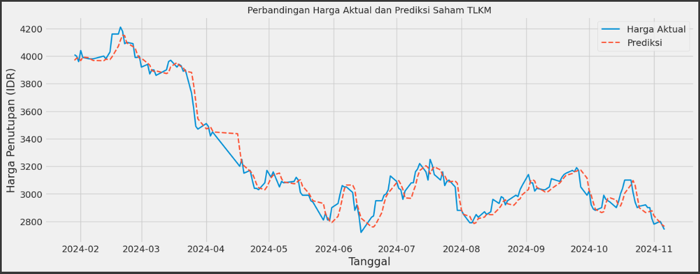

## TLKM Stock Prices Prediction Using LSTM

**Latar Belakang**:
PT Telekomunikasi Indonesia Tbk (TLKM) merupakan salah satu perusahaan BUMN terbesar di Indonesia di bidang telekomunikasi. Harga saham TLKM menjadi perhatian banyak investor karena mencerminkan stabilitas dan prospek bisnis sektor telekomunikasi nasional. Namun, seperti saham lainnya, harga TLKM berfluktuasi tergantung pada berbagai faktor seperti kondisi pasar, kebijakan pemerintah, dan sentimen investor.

Dengan kemajuan *Machine Learning (ML)*, analisis data historis dapat digunakan untuk mengidentifikasi pola dan tren harga saham. Salah satu metode populer dalam prediksi data time series adalah LSTM (Long Short-Term Memory) yang mampu menangkap pola jangka panjang dan kompleks dalam data historis. Dengan pendekatan ini, investor bisa mendapat wawasan lebih baik tentang prediksi harga saham untuk mendukung pengambilan keputusan.

**Penelitian Terkait**:
*Windha Mega Pradnya Dhuhita* menyatakan bahwa teknik LSTM, yang dikombinasikan dengan optimasi hiperparameter, memungkinkan prediksi harga yang akurat menggunakan data historis, termasuk untuk aset seperti saham maupun logam mulia seperti emas.

## Business Understanding

### Problem Statements

1. Harga saham TLKM berfluktuasi setiap hari dipengaruhi oleh banyak faktor internal dan eksternal. Fluktuasi ini bisa sulit diprediksi tanpa alat bantu statistik atau algoritma pembelajaran mesin.
2. Diperlukan sistem prediksi berbasis ML yang mampu memperkirakan harga saham di masa depan berdasarkan pola historis, dan LSTM cocok digunakan untuk menangani data sekuensial seperti harga saham.

### Goals

Mengembangkan model LSTM untuk memprediksi harga penutupan saham TLKM secara akurat berdasarkan data historis, sehingga dapat memberikan proyeksi harga yang berguna bagi investor dan analis pasar.

### Solution Statements

- Menggunakan arsitektur LSTM dengan optimasi hyperparameter
- Memanfaatkan data 5 tahun (2019-2024) untuk pelatihan
- Evaluasi menggunakan metrik MAE dan MSE

## Data Understanding

Dataset: [TLKM.JK Stock Historical Data (2019-2024)](https://www.kaggle.com/datasets/irfansaputranst/dataset-saham-tlkm-jk).

### Gambaran Umum Dataset

Berkas CSV yang digunakan memiliki total **1212 baris** dan **6 kolom**, yaitu:

| Kolom | Tipe Data | Deskripsi |
|-------|-----------|-----------|
| Date | datetime | Tanggal pencatatan |
| Open | float64 | Harga pembukaan |
| High | float64 | Harga tertinggi harian |
| Low | float64 | Harga terendah harian |
| Close | float64 | Harga penutupan |
| Volume | float64 | Volume perdagangan |

**Statistik Deskriptif**:
- Periode: 07/11/2019 - 22/10/2024
- Jumlah data: 1,212 observasi
- Tidak ada missing values

Tidak terdapat nilai null, dan seluruh data bertipe numerik.

### Korelasi Antar Variabel


Dari grafik di atas, terlihat korelasi tinggi antara variabel harga (Close, Open, High, Low, Adj Close) dan korelasi rendah antara Volume dan variabel harga lainnya. Ini menunjukkan bahwa variabel harga bergerak secara searah, sementara volume relatif independen.

**Insight**:
- Korelasi sangat kuat (>0.99) antar variabel harga (Open, High, Low, Close)
- Korelasi rendah antara Volume dan harga (~0.1)

### Visualisasi Harga

Grafik Harga Tertinggi dan Terendah TLKM:


## Data Preparation

### 1. Memilih Kolom yang Diprediksi

Kolom `Close` digunakan sebagai target prediksi, diubah menjadi array NumPy untuk keperluan pelatihan.

### 2. Normalisasi Data

Menggunakan `MinMaxScaler` dari sklearn untuk menskalakan data ke rentang \[0, 1].

### 3. Split Data

* Data latih: 80% (969 data)
* Data uji: 20% (243 data)

### 4. Membuat Windowing (Time Series Format)

Membuat input LSTM dengan window sepanjang 60 langkah waktu sebelumnya untuk memprediksi 1 langkah ke depan.

### 5. Reshape Data

Data diubah menjadi format 3 dimensi (samples, timesteps, features) yang diperlukan oleh model LSTM.

## Modeling

### Arsitektur Model LSTM:

```python
model = Sequential([
    LSTM(64, return_sequences=True, input_shape=(60, 1)),
    Dropout(0.2),
    LSTM(64, return_sequences=False),
    Dropout(0.2),
    Dense(32, activation='relu'),
    Dense(16, activation='relu'),
    Dense(1)
])
```

**Parameter Pelatihan**:
- Optimizer: Adam
- Loss function: MSE
- Metrics: MAE
- Epochs: 100
- Batch size: 32
- Callback: EarlyStopping

Model dilatih selama 100 epoch. Hasil pelatihan menunjukkan konvergensi yang baik:


Loss (MSE) dan MAE menurun secara signifikan selama pelatihan, menandakan proses belajar yang stabil.

### Metrik Evaluasi
| Metric | Nilai |
|--------|-------|
| Test Loss (MSE) | 0.000883 |
| Test MAE | 0.0224 |
| MAE Aktual | 49.53 IDR |
| Error Relatif | 1.42% |

### Visualisasi Prediksi

Hasil prediksi juga divisualisasikan dan dibandingkan dengan data aktual:



**Analisis**:
- Model mampu mengikuti tren utama
- Deviasi terjadi pada periode volatilitas tinggi
- MAE 49.53 IDR termasuk sangat baik untuk prediksi saham


### Temuan Utama:
1. Model mencapai akurasi tinggi dengan MAE 1.42%
2. Arsitektur LSTM 2-layer efektif untuk pola data ini

### Rekomendasi:
1. Penambahan fitur fundamental dan teknikal
2. Optimasi hyperparameter lebih lanjut
3. Implementasi ensemble dengan model lainnya

---

**Referensi**:

* Data: [Yahoo Finance - TLKM.JK](https://finance.yahoo.com/quote/TLKM.JK)
* Windha Mega Pradnya Dhuhita et al. (2023). *Gold Price Prediction Based On Yahoo Finance Data Using LSTM Algorithm*. IEEE Conference. 10.1109/ICIMCIS60089.2023.10349035.
